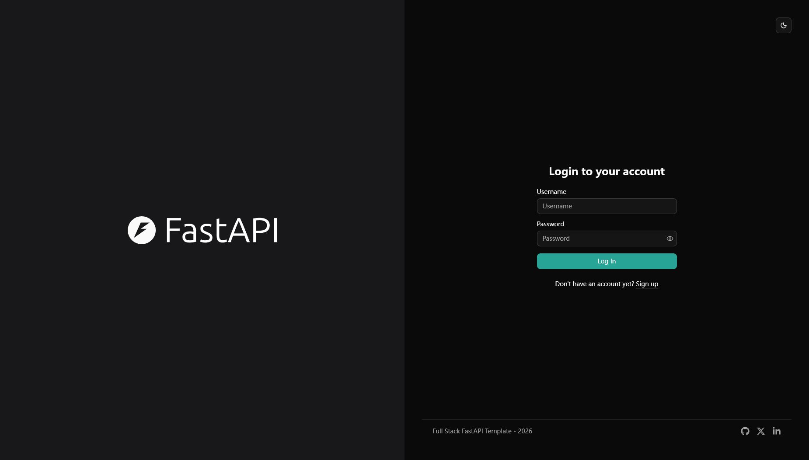
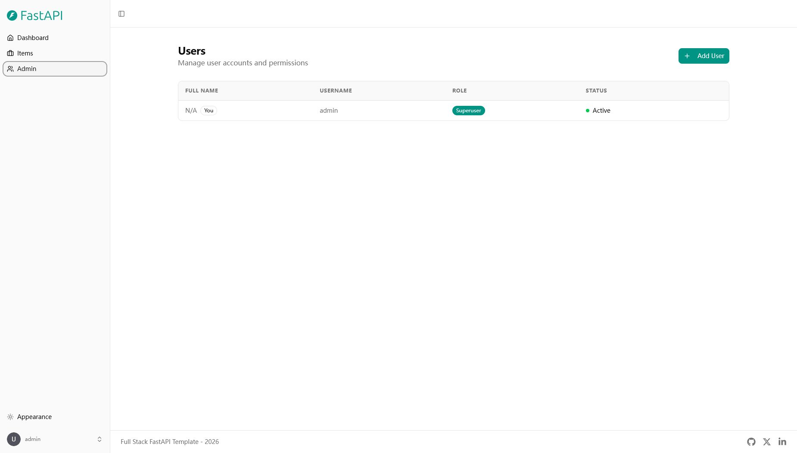
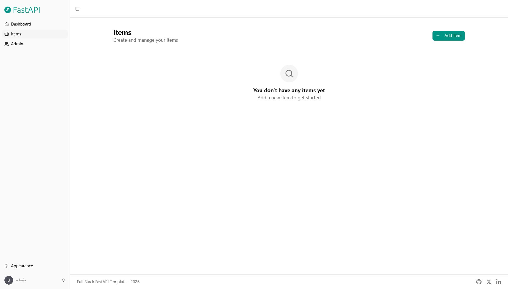
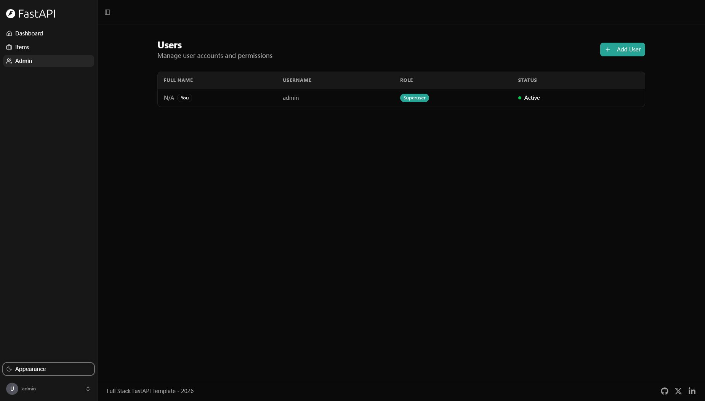
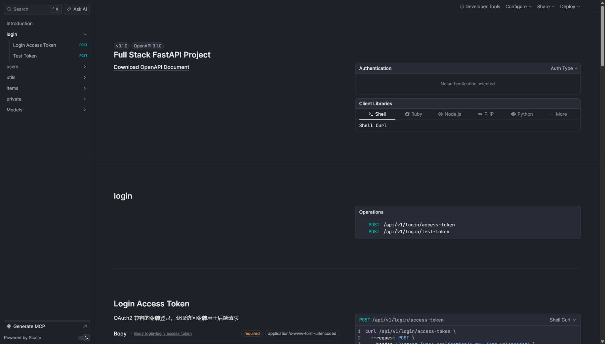

# Full Stack FastAPI Template

<a href="https://github.com/fastapi/full-stack-fastapi-template/actions?query=workflow%3A%22Test+Docker+Compose%22" target="_blank"></a>
<a href="https://github.com/fastapi/full-stack-fastapi-template/actions?query=workflow%3A%22Test+Backend%22" target="_blank"></a>
<a href="https://coverage-badge.samuelcolvin.workers.dev/redirect/fastapi/full-stack-fastapi-template" target="_blank"></a>

## 技术栈与功能特性

- ⚡ [**FastAPI**](https://fastapi.tiangolo.com) 作为 Python 后端 API。
  - 🧰 [SQLModel](https://sqlmodel.tiangolo.com) 用于 Python 与 SQL 数据库的交互（ORM）。
  - 🔍 [Pydantic](https://docs.pydantic.dev)，由 FastAPI 使用，负责数据验证和设置管理。
  - 💾 [PostgreSQL](https://www.postgresql.org) 作为 SQL 数据库。
- 🚀 [React](https://react.dev) 作为前端框架。
  - 💃 使用 TypeScript、hooks、[Vite](https://vitejs.dev) 等现代前端技术栈。
  - 🎨 [Tailwind CSS](https://tailwindcss.com) 和 [shadcn/ui](https://ui.shadcn.com) 用于前端组件开发。
  - 🤖 自动生成的前端客户端。
  - 🧪 [Playwright](https://playwright.dev) 用于端到端测试。
  - 🦇 支持暗黑模式。
- 🐋 [Docker Compose](https://www.docker.com) 用于开发和生产环境。
- 🔒 默认启用安全的密码哈希。
- 🔑 JWT (JSON Web Token) 身份认证。
- 📫 基于邮件的密码找回。
- 📬 [Mailcatcher](https://mailcatcher.me) 用于开发期间的本地邮件测试。
- ✅ 使用 [Pytest](https://pytest.org) 进行测试。
- 📞 [Traefik](https://traefik.io) 作为反向代理 / 负载均衡器。
- 🚢 提供使用 Docker Compose 的部署说明，包括如何配置前端 Traefik 代理以自动处理 HTTPS 证书。
- 🏭 基于 GitHub Actions 的 CI（持续集成）和 CD（持续部署）。

### 仪表盘登录

[](https://github.com/fastapi/full-stack-fastapi-template)

### 仪表盘 - 管理员

[](https://github.com/fastapi/full-stack-fastapi-template)

### 仪表盘 - 物品列表

[](https://github.com/fastapi/full-stack-fastapi-template)

### 仪表盘 - 暗黑模式

[](https://github.com/fastapi/full-stack-fastapi-template)

### 交互式 API 文档

[](https://github.com/fastapi/full-stack-fastapi-template)

## 如何使用

你可以直接 **fork 或 clone** 本仓库，开箱即用。

✨ 开箱即用，无需额外配置。 ✨

### 如何使用私有仓库

如果你希望拥有一个私有仓库，GitHub 不允许你直接 fork 后再修改其可见性。

但你可以按照以下步骤操作：

- 在 GitHub 上创建一个新仓库，例如 `my-full-stack`。
- 手动克隆本仓库，并将其命名为你想要使用的项目名，例如 `my-full-stack`：

```bash
git clone git@github.com:fastapi/full-stack-fastapi-template.git my-full-stack
```

- 进入新目录：

```bash
cd my-full-stack
```

- 将新的 origin 指向你的新仓库（URL 可从 GitHub 界面复制），例如：

```bash
git remote set-url origin git@github.com:octocat/my-full-stack.git
```

- 将本仓库添加为另一个 "remote"，以便日后获取更新：

```bash
git remote add upstream git@github.com:fastapi/full-stack-fastapi-template.git
```

- 将代码推送到你的新仓库：

```bash
git push -u origin master
```

### 从原始模板更新

克隆仓库并进行修改后，你可能希望获取本原始模板的最新更改。

- 确认你已将原始仓库添加为 remote，可通过以下命令查看：

```bash
git remote -v

origin    git@github.com:octocat/my-full-stack.git (fetch)
origin    git@github.com:octocat/my-full-stack.git (push)
upstream    git@github.com:fastapi/full-stack-fastapi-template.git (fetch)
upstream    git@github.com:fastapi/full-stack-fastapi-template.git (push)
```

- 拉取最新更改但不自动合并：

```bash
git pull --no-commit upstream master
```

这会从本模板下载最新更改但不会自动提交，这样你可以在提交前检查一切是否正确。

- 如果出现冲突，在编辑器中解决。

- 解决完成后，提交更改：

```bash
git merge --continue
```

### 配置

接下来你可以修改 `.env` 文件中的配置项以自定义你的设置。

在部署之前，请确保至少修改以下值：

- `SECRET_KEY`
- `FIRST_SUPERUSER_PASSWORD`
- `POSTGRES_PASSWORD`

你可以（也应该）通过密钥以环境变量的方式传入这些值。

更多详情请参阅 [deployment.md](./deployment.md) 文档。

### 生成密钥

`.env` 文件中部分环境变量的默认值是 `changethis`。

你需要将它们替换为安全的密钥。生成密钥可运行以下命令：

```bash
python -c "import secrets; print(secrets.token_urlsafe(32))"
```

复制输出内容，将其用作密码 / 密钥。再次运行可生成另一个安全密钥。

## 如何使用 - 使用 Copier 的替代方案

本仓库也支持使用 [Copier](https://copier.readthedocs.io) 来生成新项目。

它会复制所有文件，询问配置问题，并根据你的回答更新 `.env` 文件。

### 安装 Copier

你可以通过以下命令安装 Copier：

```bash
pip install copier
```

更好的方式是，如果你已有 [`pipx`](https://pipx.pypa.io/)，可以这样安装：

```bash
pipx install copier
```

**注意**：如果你已经有 `pipx`，则不必额外安装 copier，可以直接运行它。

### 使用 Copier 生成项目

确定新项目的目录名，下面的命令会用到。例如 `my-awesome-project`。

进入作为项目父目录的文件夹，使用项目名运行命令：

```bash
copier copy https://github.com/fastapi/full-stack-fastapi-template my-awesome-project --trust
```

如果你有 `pipx` 但没有安装 `copier`，可以直接运行：

```bash
pipx run copier copy https://github.com/fastapi/full-stack-fastapi-template my-awesome-project --trust
```

**注意** `--trust` 选项是必需的，它允许执行 [post-creation script](https://github.com/fastapi/full-stack-fastapi-template/blob/master/.copier/update_dotenv.py) 脚本来更新你的 `.env` 文件。

### 输入变量

Copier 会询问你一些数据，你可能需要在生成项目前准备好。

不过别担心，你之后随时可以在 `.env` 文件中修改这些值。

输入变量及其默认值（部分会自动生成）如下：

- `project_name`：（默认：`"FastAPI Project"`）项目名称，会展示给 API 用户（在 .env 中）。
- `stack_name`：（默认：`"fastapi-project"`）用于 Docker Compose 标签和项目名的栈名称（不能包含空格和句点）（在 .env 中）。
- `secret_key`：（默认：`"changethis"`）项目密钥，用于安全相关，存储在 .env 中，可使用上面的方法生成。
- `first_superuser`：（默认：`"admin@example.com"`）初始超级用户的邮箱（在 .env 中）。
- `first_superuser_password`：（默认：`"changethis"`）初始超级用户的密码（在 .env 中）。
- `smtp_host`：（默认：`""`）发送邮件的 SMTP 服务器主机，可在 .env 中稍后设置。
- `smtp_user`：（默认：`""`）发送邮件的 SMTP 服务器用户名，可在 .env 中稍后设置。
- `smtp_password`：（默认：`""`）发送邮件的 SMTP 服务器密码，可在 .env 中稍后设置。
- `emails_from_email`：（默认：`"info@example.com"`）发件邮箱账户，可在 .env 中稍后设置。
- `postgres_password`：（默认：`"changethis"`）PostgreSQL 数据库密码，存储在 .env 中，可使用上面的方法生成。
- `sentry_dsn`：（默认：`""`）Sentry 的 DSN（如果你在使用 Sentry），可在 .env 中稍后设置。

## 后端开发

后端文档：[backend/README.md](./backend/README.md)。

## 前端开发

前端文档：[frontend/README.md](./frontend/README.md)。

## 部署

部署文档：[deployment.md](./deployment.md)。

## 开发

通用开发文档：[development.md](./development.md)。

内容包括使用 Docker Compose、自定义本地域名、`.env` 配置等。

## 发布说明

查看文件 [release-notes.md](./release-notes.md)。

## 许可证

Full Stack FastAPI Template 基于 MIT 许可证授权。
